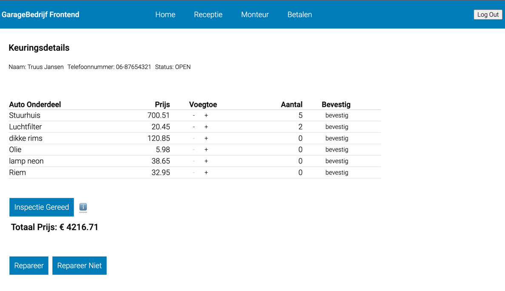
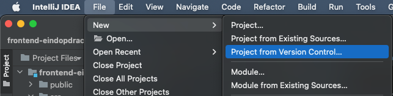
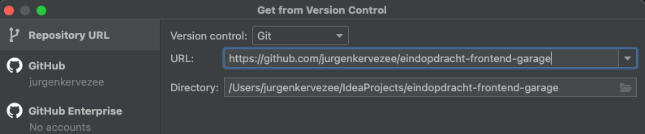
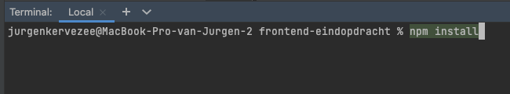
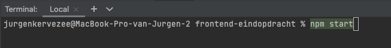

# Getting Started met Garagebedrijf Frontend
Dit is de eindopdracht voor leerlijn frontend van Novi
gemaakt door Jurgen Kervezee

### Bijgevoegde documenten / links:

Links:
De laatste versie staat op Github onder de volgende link: [Garage Frontend](https://github.com/jurgenkervezee/eindopdracht-frontend-garage)

Bijgevoegd:
- Functioneel ontwerp Frontend
- Verantwoordingsdocument Frontend
- folder Backend
  - Installatie Handleiding 
  - Technisch Ontwerp van de backend 
  
### Beschikbare Backend
Deze frontend applicatie is geschreven voor de Backend die vorig jaar is opgeleverd. 

De backend is beschikbaar op Github
[Garage backend](https://github.com/jurgenkervezee/garage-backend-2020)
Tevens zal ik de installatie handleiding en TO toevoegen. Voor verdere referentie.  

Verder is er testtooling gemaakt, namelijk API tests met Karate.
[Karate Garage Backend](https://github.com/jurgenkervezee/karateGarageBackEnd)

### Users om mee te kunnen testen.
Op dit moment is de registreer functie van de backend nog niet werkend. Dat staat op de backlog.
Je kunt de volgende users gebruiken om in te loggen.

| User name        | Wachtwoord |
|------------------|------------|
| reception-test   | 123456     |
| mechanic-test    | 123456     |
| cashier-test     | 123456     |
  
Let wel op dat de Receptie rol alleen op de Receptie pagina mag. En de monteur op de monteur pagina etc.   

### installeren van de applicatie
#### Requirements / bijzonderheden voor installatie
- Een geinstalleerde versie van IntelliJ of Webstorm
- In de communicatie naar de backend was een Cors probleem, daarom de volgende annotatie toegevoegd:
`@CrossOrigin("http://localhost:3000")`

Daarom moet de frontend applicatie ook worden gelaunched van localhost 3000

#### gebruikte NPM installaties
De volgende NPM installatie zijn gebruikt tijdens de ontwikkeling van de applicatie
- npm axios
- npm react-router-dom
- npm react-hook-form

#### inleiding
Deze applicatie is voor het administratief afhandelen van een garagebedrijf. 
De primaire functies zijn 
- Het zoeken van een klant
- Maken van een keurafspraak
- Invoer van een nieuwe klant
- Het keuren van een auto en dus de te vervangen onderdelen voor het goedkeuren van een auto administreren. 
- De auto gerepareerd of juist niet gerepareerd melden

#### installeren van de applicatie
Als je start met intellij File --> New --> Project from Version Controle 

Daarna vul je de gewenste url in 

Hierna wachten tot de computer is uitgerateld en dus alle benodigde gegevens heeft opgehaald en verwerkt. 

Daarna met de terminal tabblad aan de onderkant: 
#### `npm install` 
invoeren en op enter drukken

met het volgende commando kan de via de terminal in intelliJ de applicatie starten.
#### `npm start`

### tijdens het testen
Als je tijdens het testen geen data meer kunt gebruiken kan je nieuwe data maken door klanten op te voeren 
of de backend opnieuw te starten voor dezelfde basis set aan data. 

> veel plezier met het gebruik van de applicatie
